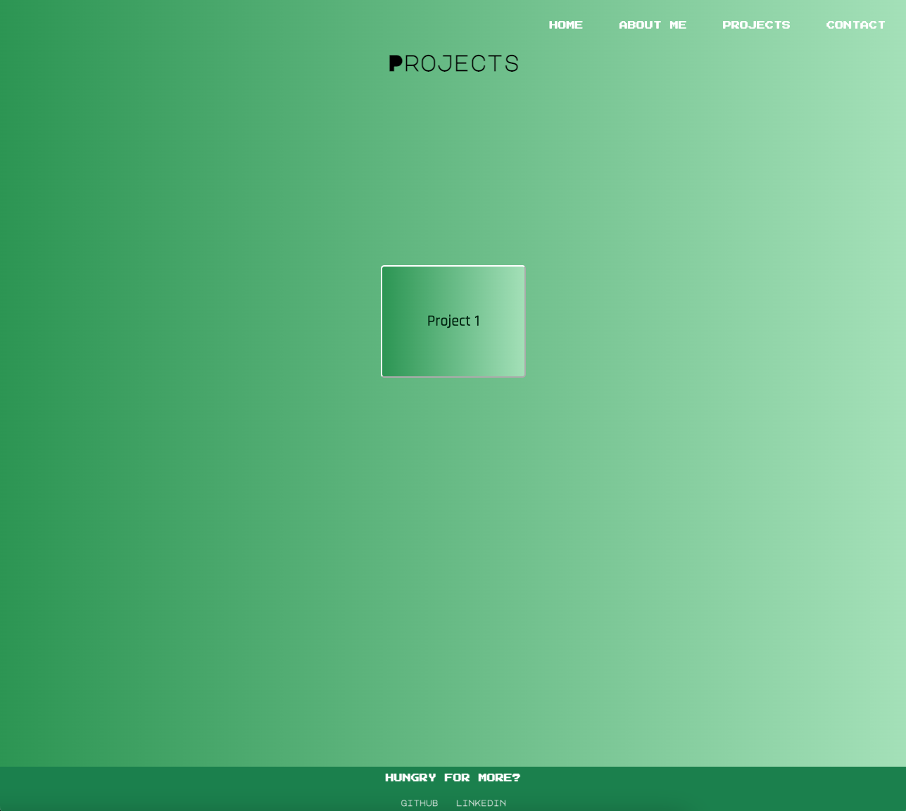

# JordanLind-Portfolio #

###Screenshots of Pages###
 
 
 
 

###List of Technologies Used###:computer:
1. HTML5
2. CSS
3. Javascript

###Installation Instructions###
My Portfolio uses Javascript so that has to be installed on my user's system. I used Github Pages for deployment.

###User Stories###:thumbsup:
1. As a non-technical recruiter, I want to see recommendations from previous employers, peers, and educators so I can validate that the candidate is appropriate for the hiring position.

2. As a product manager, I want to quickly find the candidates previous projects so I can assess if their work is cohesive with our companies expectations.

3. As a friend or family member, I want to easily navigate my friends portfolio so I can see what they have been learning and building since changing careers to a software engineer.

###Wireframes###
https://wireframe.cc/pro/pp/e1d50280a596877
https://wireframe.cc/pro/pp/e1d50280a596877#niwfeven
https://wireframe.cc/pro/pp/e1d50280a596877#14esp4yc
https://wireframe.cc/pro/pp/e1d50280a596877#t74bv24m

###Unsolved Problems and Major Hurdles###:fire:
I struggled with getting multiple event listeners to run. On different html pages I had different event listeners ('click' and 'mouseover') and only one would work at a time. If I commeneted either of the two out, the other would work. I was really not sure how to solve this problem. I struggled with getting the site to be responsive. I made sure to check frequently if it was working on smaller screens, but it took a lot of adjusting to make it look the best.

###Resources Used###:books:
Animation 
https://blog.hubspot.com/website/css-animation-not-working

Contact form using smtpjs
https://www.youtube.com/watch?v=sGQSz22U8VM&ab_channel=EasyTutorials

